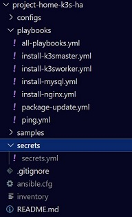

# Highly Availabile k3s Cluster with MySQL Datastore via Ansible
## Overview:

A HA k3s cluster utilizing a MySQL datastore and a Nginx load balancer.  This setup consists of the following servers:
  - 2 x Intel NUCS (running Proxmox for virtualization)
  - 1 x MySQL server
  - 1 x Nginx load balancer
  - 2 x k3s master nodes
  - 3 x k3s worker nodes

All software installation and configuration is done via Ansible playbooks.  There are sample files, listed below, that will need to be renamed, moved and edited before the Ansible playbooks can run.

## Hardware / Servers:

| Hardware         |                                   |
| ---------------- | --------------------------------- |
| Operating System | Proxmox (Latest Version)          |
| CPU              | i5-3427U CPU @ 1.80GHz (1 Socket) |
| RAM              | 16 GB                             |
| Disk Space       | 256 GB M2                         |

2 Proxmox servers were used and configured to be in a cluster.

| Virtual Machines |                                   |
| ---------------- | --------------------------------- |
| Operating System | Ubuntu 20.04 LTS                  |
| CPU              | 1 core                            |
| RAM              | 2 GB                              |
| Disk Space       | 20 GB                             |

Adjust the above specs as required as these settings are just a starting point.  

## Prerequisites:

  - 7 Virtual machines provisioned on Proxmox (or any other virtualization platform)
  - Static IP addresses assigned to each virtual machine
  - SSH key access configured on each virtual machine
  - Kubectl installed on your dev machine unless managing this cluster from one of the master nodes
 
## Sample Files:

There is a samples directory with files you will need to rename and edit prior to running the Ansible playbooks.

./samples/inventory-sample
  - Rename file to inventory and move to the root project folder
  - Configure hostnames and IP addresses for each server within the inventory file

./samples/ansible-sample.cfg
  - Rename file to ansible.cfg and move to the root project folder
  - Edit file setting the values for the following:
    - inventory = path to the inventory file
    - remote_user = user configured on each virtual machine
    - private_key_file = path to ssh key configured on each virtual machine

./samples/secrets-sample.yml
  - Create a folder called secrets in the root of project folder
  - Rename file to secrets.yml and move to ../secrets/
  - Edit file setting the values for the following:
    - mysql_password = password to set for the root MySQL user
    - k3s_mysql_password = password to set for the k3sadmin user
    - mysql ip address = IP address of the MySQL server

./samples/install-k3sworker-sample.yml
  - Rename file to install-k3sworker.yml and move to ../playbooks/
  - Edit file setting the values for the following:
    - lb_server_hostname = hostname of the load balancer in the inventory file

## Sample Folder Structure:

The following image shows what your folder structure should look like when all files are moved to the proper location.


## Secrets / Ansible Vault

Once ./secrets/secrets.yml is configured you need to encrypt the file with ansible-vault.

Encrypt the secrets file:

```ansible-vault encrypt ./secrets/secrets.yml```

Decrypt the secrets file:

```ansible-vault decrypt ./secrets/secrets.yml```

Edit the secrets file with vi:

```ansible-vault edit ./secrets/secrets.yml```

## Execution:

When all of the above is completed, execute the following command to test connectivity to all servers:

```ansible-playbook ./playbooks/ping.yml -K```

If all servers ping successfully, execute the following command to run all the playbooks:```

```ansible-playbook ./playbooks/all-playbooks.yml --ask-vault-pass -K```

## Completion:

Once the playbooks complete, k3s should be up and running.  You will need to get the config file from one of the master nodes:
  1. SSH into one of your master nodes
  2. Copy the contents of the following file: /etc/rancher/k3s/k3s.yaml
  3. Paste the contents of the file into the ~/.kube/config file on your local dev machine
  4. Edit the ~/.kube/config file replacing https://127.0.0.1:6443 with the IP:Port of the load balancer